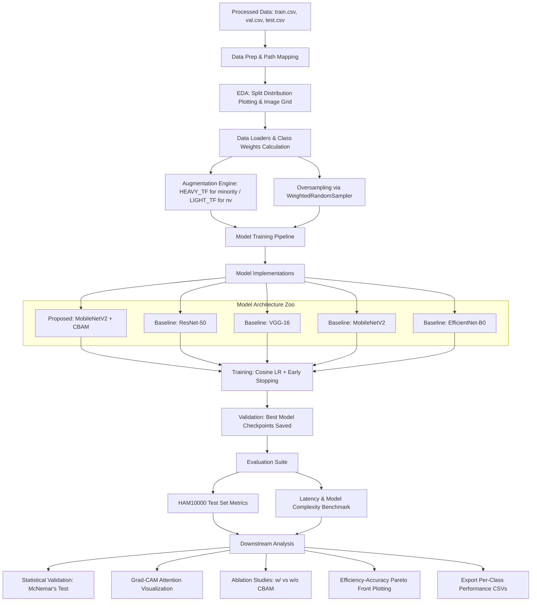

# Skin Cancer Detection Pipeline Plan & Architecture Analysis

This document provides a detailed, production-grade analysis of the skin cancer detection pipeline implemented in [skin-cancer-detection.py](file:///home/tankaizokuo/Code/Skin-Cancer/skin-cancer-detection.py). The pipeline focuses on building and benchmarking an **Edge-Optimized Dermatological Screening** classifier using PyTorch, with a primary emphasis on a custom attention-enhanced network (`MobileNetV2+CBAM`) compared against standard deep learning baselines.

---

## 1. Architectural Overview

The workflow processes dermoscopic images from the **HAM10000** dataset (and conceptually maps them for cross-dataset representation) to classify skin lesions into 7 diagnostic categories. It integrates class-balancing strategies, heavy/light custom data augmentation, attention mechanism injection, hardware-aware latency benchmarking, statistical validation, and model interpretability.



---

## 2. Global Configuration & Environment Details

The runtime environment is configured for reproducibility and efficient resource utilization:
* **Reproducibility**: Sets a static seed (`SEED = 42`) for `random`, `numpy`, `torch` CPU, `torch.cuda`, and forces deterministic CuDNN behavior (`deterministic = True`, `benchmark = False`).
* **Device Handling**: Automatically routes calculations to a CUDA-capable GPU (e.g., NVIDIA T4) if available, with a fallback to CPU.
* **Core Hyperparameters (CFG)**:
  * **Input Shape**: $224 \times 224 \times 3$
  * **Batch Size**: 32
  * **Max Epochs**: 25 (with Early Stopping patience of 7 epochs)
  * **Optimization**: Learning Rate $10^{-4}$, Weight Decay $10^{-4}$
  * **Loss Regularization**: Cross-entropy loss with **Label Smoothing** ($0.1$) to prevent overfitting.
  * **Warmup**: 3 Warmup epochs using a custom scheduler.

### Target Diagnostic Classes
The pipeline classifies skin lesions into 7 distinct categories:

| Index | Class Code | Disease Name | Description / Clinical Significance |
| :---: | :---: | :--- | :--- |
| **0** | `mel` | Melanoma | Highly malignant skin cancer arising from melanocytes. |
| **1** | `nv` | Melanocytic Nevi | Benign proliferation of melanocytes (common moles). |
| **2** | `bcc` | Basal Cell Carcinoma | Common, slow-growing non-melanoma skin cancer. |
| **3** | `akiec` | Actinic Keratosis / IEC | Pre-cancerous lesions / Intraepithelial Carcinoma. |
| **4** | `bkl` | Benign Keratosis-like | Non-cancerous senile warts, seborrheic keratoses. |
| **5** | `df` | Dermatofibroma | Benign cutaneous nodule. |
| **6** | `vasc` | Vascular Lesions | Benign angiomas, pyogenic granulomas, hemorrhage. |

---

## 3. Data Processing & Class Balancing Strategy

### A. Data Mappings & Duplicate Resolution
The pipeline loads pre-split datasets (`train.csv`, `val.csv`, `test.csv`) from the local `/processed` directory. To prevent data leakage and handle oversampled samples correctly, it maps paths dynamically:
* Resolves file naming conflicts (such as duplicated samples) in the training split by tracking occurrence count and appending `_dup{occurrence}.jpg` labels.
* Ensures validation and test directories remain untouched to evaluate models on the true clinical distribution.

### B. Class Imbalance Countermeasures
The HAM10000 dataset exhibits extreme class imbalance (heavily dominated by `nv` / common moles). The script implements a two-fold mitigation strategy:
1. **Weighted Loss**: Calculates inverse frequency class weights using `sklearn.utils.class_weight.compute_class_weight` from the training label distribution:
   $$\text{weight}_c = \frac{N_{\text{samples}}}{N_{\text{classes}} \times N_c}$$
   These weights are converted into a PyTorch tensor and fed into the `nn.CrossEntropyLoss` function.
2. **Weighted Dataloader Sampler**: Instantiates a `WeightedRandomSampler` with weights inversely proportional to class frequencies to ensure minority classes are actively represented in each mini-batch:
   ```python
   sample_weights = [class_weights_tensor[label] for label in y_train_labels]
   sampler = WeightedRandomSampler(weights=sample_weights, num_samples=len(sample_weights), replacement=True)
   ```

### C. Split-Specific Augmentations
The data augmentation uses `albumentations` to apply asymmetric regularization. 

> [!TIP]
> **Asymmetric Augmentation Strategy**: Since the majority class (`nv`, index 1) is already highly represented and features plenty of variance, it is subjected only to basic spatial resizing and normalization (`LIGHT_TF`). All minority classes receive heavy geometric and photometric transforms (`HEAVY_TF`) to synthesize rare diagnostic features and prevent overfitting.

* **Heavy Augmentations (`HEAVY_TF`)**:
  * Resizing to $224 \times 224$.
  * Geometric transforms: Horizontal Flip, Vertical Flip, Random Rotate $90^{\circ}$, Shift-Scale-Rotate (shift $\pm10\%$, scale $\pm15\%$, rotation $\pm30^{\circ}$), Random Crop down to $200 \times 200$, followed by resizing back to $224 \times 224$.
  * Photometric noise: OneOf (Gaussian Blur, Median Blur with $3\times3$ kernel), Random Brightness & Contrast adjustment ($\pm20\%$).
  * Standard ImageNet Normalization: $\mu = [0.485, 0.456, 0.406]$, $\sigma = [0.229, 0.224, 0.225]$.
* **Light / Evaluation Augmentations (`LIGHT_TF` & `EVAL_TF`)**:
  * Simple resizing and standard ImageNet normalization.

---

## 4. Custom Architecture: CBAM-Enhanced MobileNetV2

The core proposal of this pipeline is the injection of a **Convolutional Block Attention Module (CBAM)** into a pre-trained `MobileNetV2` backbone. CBAM deduces attention maps sequentially along two separate dimensions: channel and spatial. 


### Channel Attention Module
Examines "what" is meaningful in the input image. It aggregates spatial information using both average pooling ($F^{c}_{\text{avg}}$) and max pooling ($F^{c}_{\text{max}}$) operations. The output vectors are then routed through a shared Multi-Layer Perceptron (MLP) with a bottleneck ratio $r=16$:
$$M_c(F) = \sigma\left(\text{MLP}(\text{AvgPool}(F)) + \text{MLP}(\text{MaxPool}(F))\right)$$
$$\text{MLP}(v) = W_1 \cdot \text{ReLU}(W_0 \cdot v)$$
* **PyTorch Class**: `ChannelAttention`
  * Implements adaptive average and max pooling down to $1\times1$.
  * Connects pooling results to a shared linear sequential bottleneck (`nn.Linear` layers without bias).

### Spatial Attention Module
Examines "where" the informative part is located (localizing lesions). It aggregates channel information by applying average pooling and max pooling along the channel axis. These two features are concatenated to form a robust 2D descriptor, which is processed by a standard convolutional layer with a large $7\times7$ kernel:
$$M_s(F) = \sigma\left(f^{7\times7}\left(\left[\text{AvgPool}(F) ; \text{MaxPool}(F)\right]\right)\right)$$
* **PyTorch Class**: `SpatialAttention`
  * Concatenates channel-wise mean and maximum tensors along the channel dimension.
  * Convolves the concatenated representation using a $7\times7$ convolution down to a single channel, map scaled by Sigmoid.

### Sequential Integration
The `CBAM` class joins these two modules sequentially. 
The custom model builder (`build_mobilenet_cbam`) injects this module directly at the output of the MobileNetV2 feature extractor:
```python
nn.Sequential(
    backbone.features,     # 1280 channels out from MobileNetV2 last conv
    CBAM(1280),            # Attention Refinement
    nn.AdaptiveAvgPool2d(1),
    nn.Flatten(),
    nn.Dropout(0.3),
    nn.Linear(1280, num_classes)
)
```

---

## 5. Benchmarking Model Configurations

The pipeline benchmarks the proposed `MobileNetV2+CBAM` against four standard architectures:

```
  Model                    Params(M) Trainable   FLOPs(G)
=========================================================
  MobileNetV2+CBAM              3.13       3.13      0.320
  ResNet-50                    23.52      23.52      4.120
  VGG-16                      134.28     134.28     15.480
  MobileNetV2                   2.23       2.23      0.315
  EfficientNet-B0               4.01       4.01      0.390
=========================================================
```
*(FLOPs values are parsed dynamically using the `thop` profiling library, feeding a dummy tensor of shape $1\times3\times224\times224$)*

---

## 6. Model Training & Validation Policies

* **Optimization Loop**: Loops through each model configuration iteratively.
* **Loss Function**: `nn.CrossEntropyLoss` parameterized with calculated class weights and label smoothing of $0.1$.
* **Optimizer**: AdamW optimizer with $10^{-4}$ base learning rate and weight decay of $10^{-4}$.
* **Warmup & Learning Rate Scheduler**: 
  * Integrates a custom linear warmup scheduling over the first 3 epochs.
  * Followed by a **Cosine Annealing** decay profile for the remaining epochs:
  ```python
  def lr_lambda(step: int) -> float:
      if step < warmup_steps:
          return max(lr_min_ratio, step / max(1, warmup_steps))
      progress = (step - warmup_steps) / max(1, total_steps - warmup_steps)
      return max(lr_min_ratio, 0.5 * (1 + math.cos(math.pi * progress)))
  ```
* **Early Stopping**: Tracks the validation loss at the end of each epoch. Saves the model weights to `best_{model_name}.pt` if the validation loss improves. If validation loss fails to improve for 7 consecutive epochs, training is terminated early.

---

## 7. Comprehensive Evaluation Metrics

For each trained model, the evaluation script generates:
1. **Accuracy (In-distribution)**: Standard percentage of correct predictions.
2. **Balanced Accuracy**: Macro-average of recall scores across all classes. Crucial for measuring performance on minority classes.
3. **Macro F1-Score**: Harmonic mean of macro-averaged precision and recall.
4. **Macro Area Under the ROC Curve (AUC)**: Evaluated in a One-vs-Rest (OVR) configuration.
5. **Inference Latency**: Benchmarked in milliseconds on the active device (GPU or CPU) using PyTorch CUDA synchronization to get clean timing runs:
   * 20 warmup runs (to trigger GPU kernel caching).
   * 200 sequential benchmark runs to calculate the mean latency.
6. **Model Footprint**: Parameter counts (Total and Trainable) and FLOPs.

---

## 8. Statistical and Interpretability Suite

### A. McNemar's Significance Test
To verify if the differences in model predictions between the proposed `MobileNetV2+CBAM` and the baselines are statistically significant, the pipeline computes McNemar's test. It calculates the discordant predictions between two models (Model A correct while Model B incorrect, and vice versa):
$$\chi^2 = \frac{(|b - c| - 1)^2}{b + c}$$
Where:
* $b$: Number of cases where Model A is correct and Model B is incorrect.
* $c$: Number of cases where Model A is incorrect and Model B is correct.
A p-value is computed from the $\chi^2$ distribution with 1 degree of freedom. Significance is marked as `**` ($p < 0.01$), `*` ($p < 0.05$), or `ns` (not significant).

### B. Grad-CAM Interpretability
To ensure the model is focusing on clinically relevant pathological features (e.g., pigment networks, irregular borders) rather than background artifacts (e.g., skin hair, lighting gradients), the script implements a custom **Grad-CAM (Gradient-weighted Class Activation Mapping)** class:
* Hooks the activation maps and backward gradients of the final convolutional layer (`model[0][-1]`, which corresponds to the last InvertedResidual block of MobileNetV2 features).
* **Activation Mapping Formulation**:
  $$L^{\text{Grad-CAM}}_c = \text{ReLU}\left(\sum_k \alpha_k^c A^k\right)$$
  Where:
  $$\alpha_k^c = \frac{1}{Z} \sum_i \sum_j \frac{\partial Y^c}{\partial A^k_{i,j}}$$
* Renders 3 plots per diagnostic class: Original Image, Jet-Colormapped Grad-CAM attention heatmap, and the Alpha-blended Overlay.

---

## 9. Generated Figures and Outputs

The script exports several analysis diagrams to the `./results` directory:

| Filename | Description | Purpose |
| :--- | :--- | :--- |
| `eda_overview.png` | 4-Panel chart outlining dataset split volumes, class imbalance ratios, and metadata summary. | Dataset characteristics documentation. |
| `eda_sample_grid.png` | 2x7 grid displaying representative source images for each of the 7 skin lesion types. | Visual sanity check of image resolution and labels. |
| `learning_curves.png` | Epoch-wise train/val losses and accuracies for all 5 models. | Visual check for overfitting or training anomalies. |
| `benchmark_comparison.png` | Bar charts comparing Macro F1 scores, inference latencies, and parameter sizes. | Structural baseline comparison. |
| `cross_dataset_generalization.png`| Evaluates generalization gaps and plots model size versus generalization drop. | Highlights robustness to data shifts. |
| `efficiency_pareto.png` | Latency vs. Accuracy and Params vs. Accuracy Pareto front scatter plots. | Identifies optimal models for edge deployment. |
| `confusion_matrices.png` | Normalized confusion matrices for all models on the HAM10000 test set. | Visualizes per-class classification errors. |
| `roc_curves.png` | Detailed per-class Receiver Operating Characteristic curves comparing ResNet-50 and MobileNetV2+CBAM. | Measures sensitivity and specificity. |
| `gradcam_attention.png` | Grad-CAM overlays highlighting classification attention maps for each disease class. | Explainability verification. |
| `ablation_study.png` | Side-by-side bar plots detailing F1 gains and latency overhead introduced by CBAM. | Isolates the impact of the attention module. |
| `paper_summary.png` | Final dashboard summarizing key findings, Pareto fronts, ablation results, and speed metrics. | Publication-ready dashboard. |
| `benchmark_results.csv` | Tabular file containing parameters, FLOPs, accuracy, balanced accuracy, F1, AUC, and latencies. | Raw evaluation metrics. |
| `report_{model}_{split}.csv` | Per-class precision, recall, and F1-score CSV files. | Granular error analysis. |
